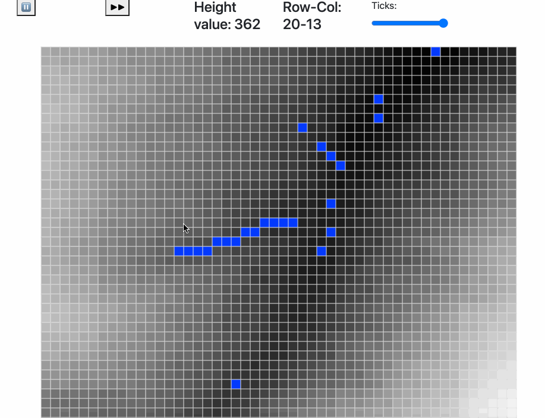

### Wasm Water Flow Simulation

I created this project to test out WASM & Rust. 

Currently it can quite modestly simulate the path of a water drop on a terrain.

### Roadmap:

- [x] Basic water flow dynamics
- [x] Render a real-world height data
- [ ] Show simulated area on real map
- [ ] Pre-select water cells then run simulation

I created this project using; https://github.com/rustwasm/wasm-pack