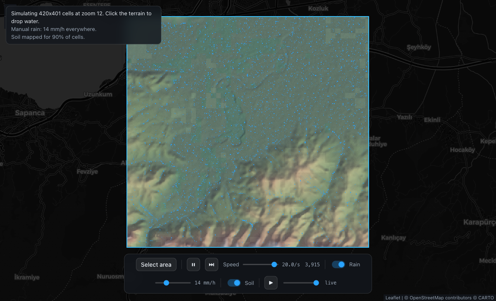

# wasm-water-simulation

Pick an area on the map. The browser fetches that area's real elevation, the
weather radar currently over it, and the soil underneath, then runs a water flow
simulation on the result. No API keys, no server, no data files.



Terrain is shaded by height and lit from the north west. Blue dots are live
water, the fainter lines behind them are where water has recently run, which is
how the drainage network draws itself. Rain comes from live radar, and how much
of it soaks away depends on the soil.

## How it works

Rust does the flow simulation and nothing else. It takes a plain grid of heights
and an infiltration grid, and knows nothing about maps, projections or file
formats. JS does all the geodata: Web Mercator tile math, fetching, decoding,
stitching.

Everything decodes with native browser APIs. `ImageDecoder` for PNG,
`DecompressionStream` for deflate. Tile payloads are data, not pictures, so they
never go through a canvas: colour management can shift a channel, and one step
in red is a 256 m elevation error.

| Layer | Source |
|---|---|
| Elevation | AWS Terrain Tiles (terrarium PNG) |
| Rain | RainViewer radar |
| Soil | ISRIC SoilGrids sand/silt/clay |
| Place search | Photon |
| Basemap | CARTO / OpenStreetMap |

```
src/lib.rs        the simulation, pure Rust
www/tiles.mjs     tile math and the shared fetch/decode/stitch
www/elevation.mjs terrain tiles to metres
www/rain.mjs      radar to mm/h per cell
www/soil.mjs      texture to infiltration capacity
www/places.mjs    place name to a map view
www/index.js      map, render loop, rain spawner, UI
```

## Build

Needs Rust, [wasm-pack](https://rustwasm.github.io/wasm-pack/installer/) and Node 18+.

```sh
wasm-pack build          # writes pkg/, which www/ depends on
cd www
npm install
npm start                # http://localhost:8080
```

`wasm-pack build` has to run first. `www/package.json` depends on `file:../pkg`,
so `npm install` fails if `pkg/` is not there yet. Re-run it after any change to
`src/`.

## Test

```sh
cargo test               # flow algorithm
cd www && npm test       # tile math, elevation, rain, soil, search
```

The JS suites are plain `node file.test.mjs` with `node:assert`. No framework,
no runner, no config.

## Roadmap

- [x] Basic water flow dynamics
- [x] Render real world height data
- [x] Pick the area to simulate from a map
- [x] Live rainfall from weather radar
- [x] Soil absorption from a soil survey
- [ ] Land cover, which matters more than soil in built up areas
- [ ] Soil saturating as a storm goes on, so late rain runs off

## Licence

MIT or Apache-2.0, at your option.

Started from [wasm-pack-template](https://github.com/rustwasm/wasm-pack).
